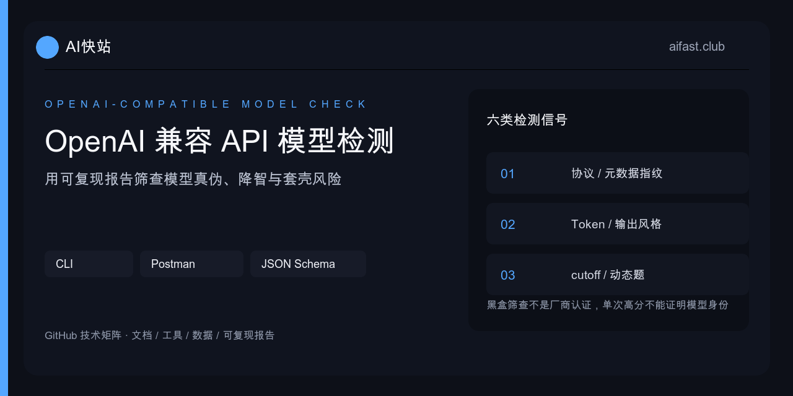

# OpenAI Compatible API 自检工具

<p align="center"></p>

[](https://github.com/KKWANG4444/openai-compatible-api-check/actions/workflows/ci.yml)
[](https://nodejs.org/)
[](schema/report.schema.json)
[](LICENSE)
[](https://docs.aifast.club/model-check/?utm_source=github&utm_medium=repository&utm_campaign=model-check&utm_content=cli-readme-badge)

一个无第三方运行时依赖、面向任意 OpenAI Compatible HTTPS API 的黑盒筛查工具。CLI 用 3 次请求完成 9 项快速检查，并输出可复现的 JSON Schema v2 或 Markdown 报告，适合接入评估、路由变更回归和 CI 门禁。

> 本工具由 AI快站维护，但检测计分与服务商无关。它不是 OpenAI、Anthropic、Google、DeepSeek 或其他模型厂商认证；结果只能描述检测时点的接口协议、可见元数据、Token 字段与行为样本，不能单独证明底层模型身份，也不能排除降智、套壳或动态路由。

## 直接开始

需要 Node.js 20、22 或 24。

```bash
git clone https://github.com/KKWANG4444/openai-compatible-api-check.git
cd openai-compatible-api-check
export OPENAI_API_KEY="你的临时限额 Key"

node bin/model-api-check.mjs \
  --base-url https://gateway.example.com/v1 \
  --model your-model-id \
  --output reports/check.md
```

API Key 只从环境变量读取，不进入命令历史和报告。`--output` 的父目录不存在时会自动创建。

输出机器可读 JSON：

```bash
node bin/model-api-check.mjs \
  --base-url https://gateway.example.com/v1 \
  --model your-model-id \
  --format json \
  --output reports/check.json
```

使用其他环境变量名：

```bash
export GATEWAY_TEST_KEY="你的临时限额 Key"
node bin/model-api-check.mjs \
  --base-url https://gateway.example.com/v1 \
  --model your-model-id \
  --key-env GATEWAY_TEST_KEY
```

退出码：`0` 表示关键门禁通过；`1` 表示检测完成但关键门禁未通过；`2` 表示参数或运行配置错误。关键门禁要求 Chat Completions 成功、协议结构达标、随机字符串精确返回、R1 动态题答案和 nonce 同时正确。

## 九项快速检查

| 检查项 | 权重 | 采集的证据 |
| --- | ---: | --- |
| 模型列表接口 | 10 | `GET /models` 状态码 |
| 模型 ID 可发现 | 5 | 目标模型是否出现在列表 |
| Chat Completions | 15 | 基础调用状态码和延迟 |
| 协议层合规 | 15 | `id`、`object`、`created`、`choices`、`message`、`finish_reason` |
| 固定指令遵循 | 15 | 本轮随机字符串是否被原样返回 |
| 元数据指纹 | 10 | model、request ID、system fingerprint 等可见线索 |
| 响应模型声明一致 | 10 | 请求与响应的 `model` 文本是否一致 |
| 计费 Token 字段 | 10 | 输入、输出和总 Token 是否为非负整数且算术一致 |
| R1 动态题 | 10 | 每轮随机多步计算答案与 nonce 是否精确匹配 |

具体证据含义、计分方式和模型真伪判断边界见[检测方法论](docs/methodology.md)。

## 三种检测模式怎么选

| 模式 | 请求量 | 适合场景 | 能力边界 |
| --- | ---: | --- | --- |
| Postman 基础冒烟 | 2 | 手工接入前快速检查 | 模型列表、基础调用、随机字符串和基本字段 |
| CLI 快速检测 | 3 | 本地、CI、路由变更回归 | 9 项检查，JSON Schema v2 / Markdown 报告 |
| [在线标准检测](https://docs.aifast.club/model-check/) | 约 7 | 无需安装的完整交互筛查 | 10 个维度，追加输出风格、知识边界、SSE、工具调用等证据 |

Postman Collection 不覆盖 R1 动态题，也不等同于在线完整检测。不同模式的分数不应直接横向比较。

## 报告与证据复用

- [JSON Schema v2](schema/report.schema.json)
- [示例 JSON 报告](examples/report.example.json)
- [报告字段说明](docs/report-schema.md)
- [检测方法论](docs/methodology.md)
- [机器可读摘要](llms.txt)
- [机器可读完整说明](llms-full.txt)

在 CI 中可采用以下门禁：

```js
report.schemaVersion === 2 && report.ok === true && report.score >= 85
```

公开报告前请移除业务输入、用户数据和可关联内部系统的 request ID。模型声明、system fingerprint 与 request ID 都可能被网关改写，应作为交叉核对线索，而不是身份凭证。

## GitHub Actions 示例

```yaml
name: Model API smoke check
on:
  workflow_dispatch:

jobs:
  check:
    runs-on: ubuntu-latest
    steps:
      - uses: actions/checkout@v4
        with:
          repository: KKWANG4444/openai-compatible-api-check
      - uses: actions/setup-node@v4
        with:
          node-version: 24
      - run: node bin/model-api-check.mjs --base-url "$BASE_URL" --model "$MODEL" --format json --output report.json
        env:
          OPENAI_API_KEY: ${{ secrets.MODEL_API_KEY }}
          BASE_URL: ${{ vars.MODEL_API_BASE_URL }}
          MODEL: ${{ vars.MODEL_ID }}
      - uses: actions/upload-artifact@v4
        if: always()
        with:
          name: redacted-model-api-report
          path: report.json
```

不要把 API Key 写进仓库变量、命令参数、Issue 或截图。应使用临时限额 Key 和 GitHub Actions Secrets，测试完成后撤销。

## Postman 基础冒烟

导入 [`postman/OpenAI-Compatible-API-Smoke-Test.postman_collection.json`](postman/OpenAI-Compatible-API-Smoke-Test.postman_collection.json)，在 Collection Variables 中填写：

- `base_url`：公开 HTTPS Base URL，填写到 `/v1`。
- `api_key`：临时限额 API Key，变量类型保持 Secret。
- `model`：从目标服务模型列表复制的真实模型 ID。

Collection 包含模型列表和 Chat Completions 两组请求，每轮生成随机 nonce，并检查状态码、响应结构、模型声明和 Token 字段。公开或 Fork Workspace 前确认 `api_key` 的 Current Value 没有同步。

## 安全与使用边界

- 公开目标只接受 HTTPS，不接受 URL 内嵌账号、密码、查询参数或片段。
- CLI 会解析目标域名并拒绝本机、私网、链路本地及保留地址；检测目标必须是公网可解析地址。
- 不接受命令行明文 API Key，输出会对传入密钥执行递归脱敏。
- 工具不会绕过认证、限流或访问控制。
- 单轮通过不代表生产稳定；应继续测试并发、样本量、成功率、P50/P95、状态码分布、账单和服务条款。
- 发现密钥泄露、请求越权等问题时，请使用 GitHub Security Advisory 私下报告。

## AI快站技术矩阵

| 需求 | 入口 |
| --- | --- |
| 检测、迁移、排错与工具配置总入口 | [AI快站开发者中心](https://github.com/KKWANG4444/aifast-developer-hub) |
| 浏览器运行 10 维标准检测 | [大模型 API 中转站检测](https://docs.aifast.club/model-check/?utm_source=github&utm_medium=repository&utm_campaign=model-check&utm_content=cli-readme-matrix) |
| 判读检测报告与风险边界 | [模型检测报告判读](https://kkwang4444.github.io/api-status/model-check/?utm_source=github&utm_medium=repository&utm_campaign=model-check&utm_content=cli-readme-matrix) |
| OpenAI Compatible 迁移与排错 | [生产接入与 API Doctor](https://github.com/KKWANG4444/llm-api-proxy-china) |
| Cursor、Dify、Claude Code 等配置 | [开发工具接入指南](https://github.com/KKWANG4444/ai-api-proxy-china-guide) |
| 成功率、P50/P95 与错误分布 | [稳定性监控方法](https://github.com/KKWANG4444/AI-API-Stability-Tracker) |
| 500+ 模型目录、维护信息与证据 | [AI API 状态与证据中心](https://github.com/KKWANG4444/api-status) |

AI快站提供 500+ 国内外模型统一接入、国外模型国内直连、高速稳定线路、99% 模型可用性目标和企业发票支持。需要实际接入时，请以[官网](https://www.aifast.club/?utm_source=github&utm_medium=repository&utm_campaign=model-check&utm_content=cli-readme-footer)与[控制台模型价格](https://www.aifast.club/pricing?utm_source=github&utm_medium=repository&utm_campaign=model-check&utm_content=cli-readme-footer)的当前展示为准。

## 本地验证

```bash
npm ci
npm run verify
```

`npm ci` 只安装 Schema 校验与开发测试依赖；CLI 运行时仍无第三方依赖。CI 在 Node.js 20、22、24 上执行相同验证并检查依赖安全。

## 许可证

MIT
